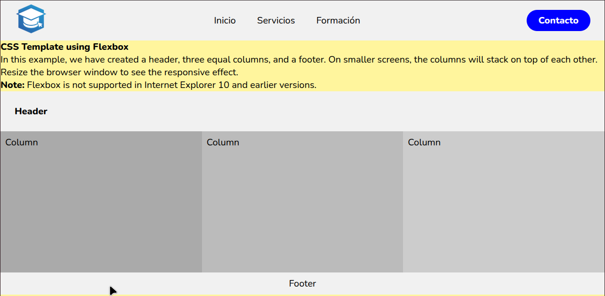

# DEMO

# Proyecto CSS Template con Flexbox

Este proyecto es una plantilla básica que muestra cómo utilizar Flexbox para crear un diseño responsivo con un encabezado (header), tres columnas iguales y un pie de página (footer). La plantilla incluye un menú de navegación y un botón de contacto, con estilos modernos y efectos hover.

---

## Estructura del Proyecto

- `index.html`: Archivo principal con la estructura HTML.
- `style.css`: Archivo CSS que contiene los estilos, incluyendo Flexbox para la disposición del contenido y diseño responsivo.
- Uso de la fuente **Nunito** desde Google Fonts para una tipografía moderna y limpia.

---

## Características

- **Diseño responsivo**: Las columnas se adaptan y apilan verticalmente en pantallas pequeñas (menos de 600px de ancho).
- **Encabezado con logo y navegación**:
  - Logo con efecto hover de escala.
  - Menú de navegación con enlaces a diferentes secciones.
  - Botón de contacto con animación hover.
- Uso de Flexbox para distribuir los elementos de manera eficiente y sencilla.
- Compatibilidad con navegadores modernos (no compatible con Internet Explorer 10 y anteriores).
- Colores y estilos personalizables mediante CSS.

---
